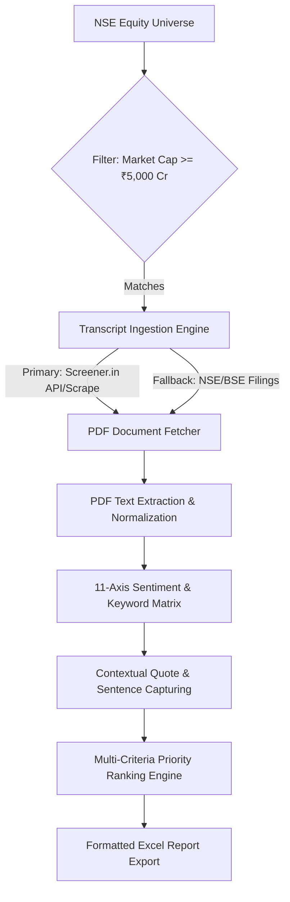

# Concall Analyser

An automated data pipeline for downloading, parsing, and evaluating **earnings call (concall) transcripts** of NSE-listed equities with a market capitalization of **₹5,000 crore or more**. 

The system programmatically ingests corporate transcripts, scans textual data against an 11-axis financial signal dictionary using natural language proximity mapping, flags supporting contextual quotes, and exports a prioritized, institutional-grade equity screening report in Excel.

<p align="center">
  
  
  
  
</p>

---

## Core Architecture & Workflow



---

## Tech Stack

| Component | Technology | Purpose |
|:---|:---|:---|
| **Language Runtime** | Python 3.9+ | Base engine execution |
| **Data Processing** | Pandas, NumPy | Universe filtering, sorting, and structural ranking |
| **Document Parsing** | PDFPlumber / PyPDF | High-fidelity text and coordinate extraction from filings |
| **Network & Ingestion**| Requests, BeautifulSoup4 | Session-managed downloading and fallback routing |
| **Report Generation** | OpenPyXL | Programmatic Excel rendering, cell coloring, and formatting |

---

## Signal Classification Matrix

The parsing engine scores each transcript across **11 distinct categorical axes**. A category is triggered once per document if any corresponding semantic synonyms match, preventing scoring bias from repetitive executive phrasing:

* **Topline & Velocity:** High Growth / Revenue Trajectory
* **Backlog Visibility:** Order Books & Execution Timelines
* **Profitability Dynamics:** Margin Expansion & Pricing Power
* **Asset Creation:** Capacity Expansion & Capex Guidance
* **Operational Optimization:** Corporate Integration & Structural Efficiency
* **Competitive Moat:** Market Share Capture & Volume Growth
* **Balance Sheet Health:** Deleveraging, Debt Reduction, & Interest Cover
* **Liquidity Inflow:** Cash Generation & Free Cash Flow (FCF) Metrics
* **Working Capital Cycles:** Inventory Days, Debtor Cycles, & Cash Conversion
* **Capital Efficiency:** Return Ratios (RoE, RoCE, RoIC)
* **Strategic Realignments:** Corporate Actions (Demergers, Mergers, Spin-offs)

---

## Installation & Setup

### Prerequisites
Ensure you have Python 3.9 or higher installed on your system.

### 1. Clone the Repository
```bash
git clone [https://github.com/YourUsername/concall-analyser.git](https://github.com/YourUsername/concall-analyser.git)
cd concall-analyser
```

### 2. Install Dependencies
```bash
pip install -r requirements.txt
```

---

## Production Ingestion & Usage

To execute the pipeline using default parameters:

```bash
python analyser_final.py
```

### Configuration Parameters
Pipeline thresholds and semantic parameters can be modified directly within the configuration block at the top of `analyser_final.py`:
* **Market-Cap Floor:** Modify the minimum market capitalization filter (default: `5000` Cr).
* **Priority Tiering:** Customize the category match thresholds that classify equities into `High`, `Medium`, or `Low` visibility buckets.
* **Keyword Dictionary:** Append custom corporate vernacular or sector-specific synonyms to the structural scoring array.

All output workbooks are written to the auto-generated `/concall_output` directory.

---

## Sample Deliverable

A pre-generated sample report is available at [`concall_output/Final Output.xlsx`](concall_output/Final%20Output.xlsx) to review the structural layout, typography, cell conditional formatting, and quote-capture mapping without running the full extraction pipeline.

---

## Compliance & Legal Disclaimers

### Financial Disclaimer
*This software application is strictly an automated data aggregation and research screening tool. It does not constitute investment advice, financial planning, or equity recommendations. The developer is not a SEBI-registered investment advisor. All metrics and generated reports are for educational and quantitative research purposes only.*

### Data Source Ingestion Notice
*Transcript files are extracted from publicly accessible investor relations interfaces, including Screener.in and official exchange portals (NSE/BSE). Users must remain strictly compliant with the rate-limiting thresholds, robots.txt boundaries, and overarching terms of service governing these platform nodes.*
